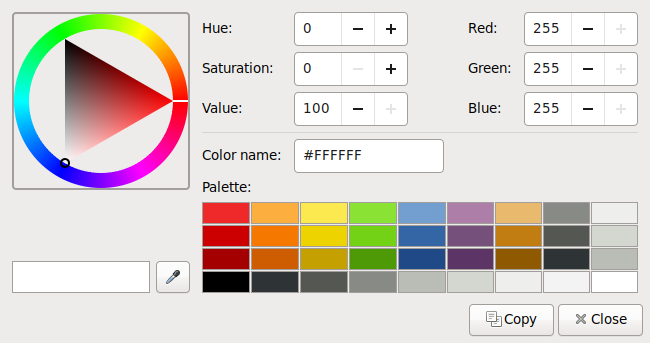
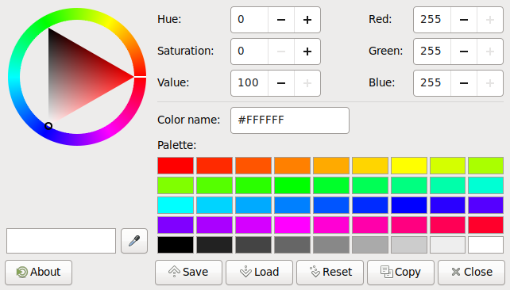

mate-color-select
=================

included in mate-desktop

https://github.com/mate-desktop/mate-desktop

  
Original **MATE Color Selection** from _Applications Menu_.  
Palette is read-only and follows the Tango Desktop guidelines.

  
As I would like them to be!

